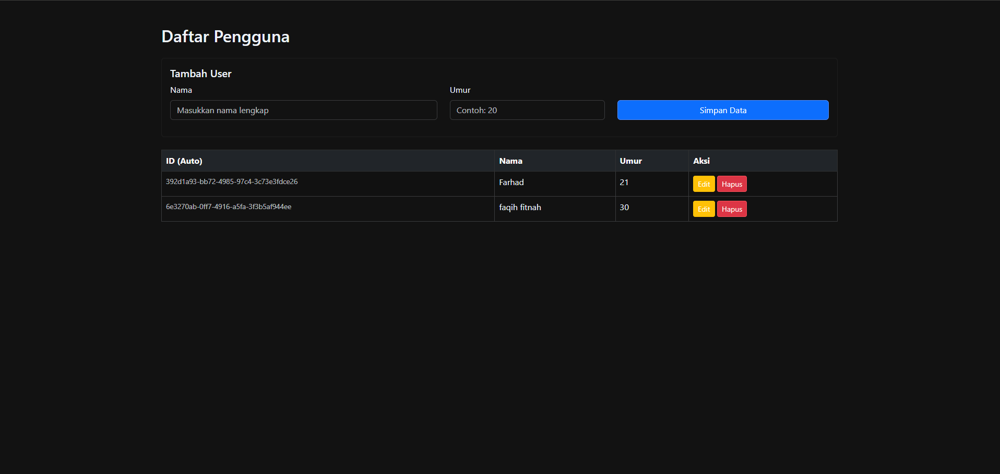

# User API Documentation

---

## Base URL
Semua endpoint berada di bawah path:
```text
/api/users
```

---

## Struktur Data

### User Request (Payload)
Digunakan saat melakukan `POST` dan `PUT`.
```json
{
  "name": "string",
  "age": 0
}
```

### User Response (Data)
Data objek `User` yang direturn oleh sistem.
```json
{
  "id": "string (UUID)",
  "name": "string",
  "age": 0
}
```

---

## Endpoints

### 1. Menambahkan User Baru
Membuat data user baru.

- **URL:** `/api/users`
- **Method:** `POST`
- **Headers:** `Content-Type: application/json`
- **Request Body:**

```json
{
  "name": "Farhad Dipta",
  "age": 21
}
```

- **Success Response (201 Created):**

```json
{
  "status": "success",
  "data": {
    "id": "b7f3a9d2-1c4e-4a0b-9f8e-12a345bc6789",
    "name": "Farhad Dipta",
    "age": 21
  }
}
```

- **Failure Response (400 Bad Request):**  
  Terjadi jika data tidak valid / kosong (validation error).

```json
{
  "timestamp": "2026-03-04T06:50:00.000+00:00",
  "status": 400,
  "error": "Bad Request",
  "path": "/api/users"
}
```

---

### 2. Mengambil Semua Data User
Mendapatkan daftar seluruh user yang ada di database.

- **URL:** `/api/users`
- **Method:** `GET`
- **Success Response (200 OK):**

```json
{
  "status": "success",
  "data": [
    {
      "id": "b7f3a9d2-1c4e-4a0b-9f8e-12a345bc6789",
      "name": "Farhad Dipta",
      "age": 21
    },
    {
      "id": "c91d8e44-9b21-4b7a-8c3f-98d2a1ef4567",
      "name": "Dina Pratiwi",
      "age": 22
    }
  ]
}
```

---

### 3. Mengambil Detail User Berdasarkan ID
Mendapatkan data user berdasarkan ID.

- **URL:** `/api/users/{id}`
- **Method:** `GET`
- **Success Response (200 OK):**

```json
{
  "status": "success",
  "data": {
    "id": "b7f3a9d2-1c4e-4a0b-9f8e-12a345bc6789",
    "name": "Farhad Dipta",
    "age": 21
  }
}
```

- **Failure Response (500 Internal Server Error):**  
  Terjadi jika user tidak ditemukan.

```json
{
  "timestamp": "2026-03-04T06:55:00.000+00:00",
  "status": 500,
  "error": "Internal Server Error",
  "message": "User Not found",
  "path": "/api/users/b7f3a9d2-xxxx-xxxx-xxxx-xxxxxxxxxxxx"
}
```

---

### 4. Mengubah Data User Berdasarkan ID
Memperbarui data user yang sudah ada.

- **URL:** `/api/users/{id}`
- **Method:** `PUT`
- **Headers:** `Content-Type: application/json`
- **Request Body:**

```json
{
  "name": "Farhad Dipta Updated",
  "age": 22
}
```

- **Success Response (200 OK):**

```json
{
  "status": "success",
  "data": {
    "id": "b7f3a9d2-1c4e-4a0b-9f8e-12a345bc6789",
    "name": "Farhad Dipta Updated",
    "age": 22
  }
}
```

- **Failure Response (500 Internal Server Error):**

```json
{
  "timestamp": "2026-03-04T07:00:00.000+00:00",
  "status": 500,
  "error": "Internal Server Error",
  "message": "User Not found",
  "path": "/api/users/b7f3a9d2-xxxx-xxxx-xxxx-xxxxxxxxxxxx"
}
```

---

### 5. Menghapus User Berdasarkan ID
Menghapus data user dari sistem.

- **URL:** `/api/users/{id}`
- **Method:** `DELETE`
- **Success Response (200 OK):**

```json
{
  "status": "success delete user with id b7f3a9d2-1c4e-4a0b-9f8e-12a345bc6789"
}
```

- **Failure Response (500 Internal Server Error):**

```json
{
  "timestamp": "2026-03-04T07:05:00.000+00:00",
  "status": 500,
  "error": "Internal Server Error",
  "message": "user not found",
  "path": "/api/users/b7f3a9d2-xxxx-xxxx-xxxx-xxxxxxxxxxxx"
}
```